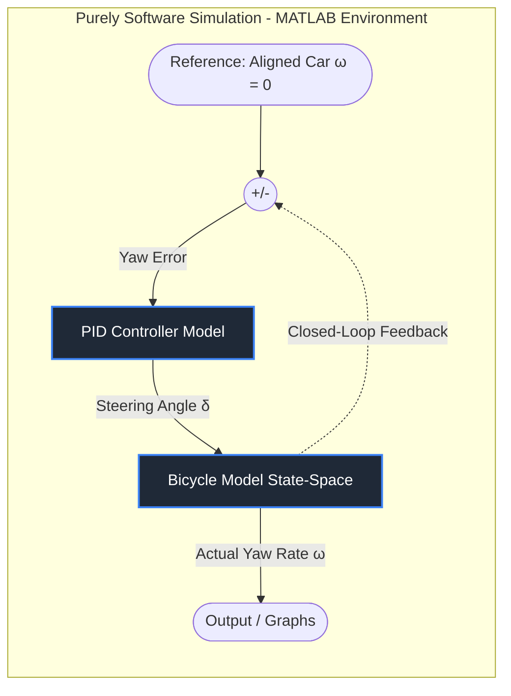
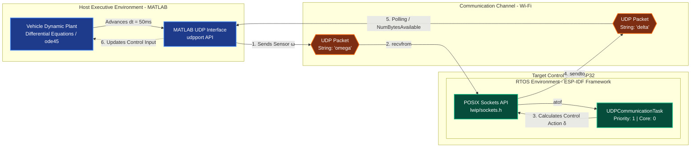
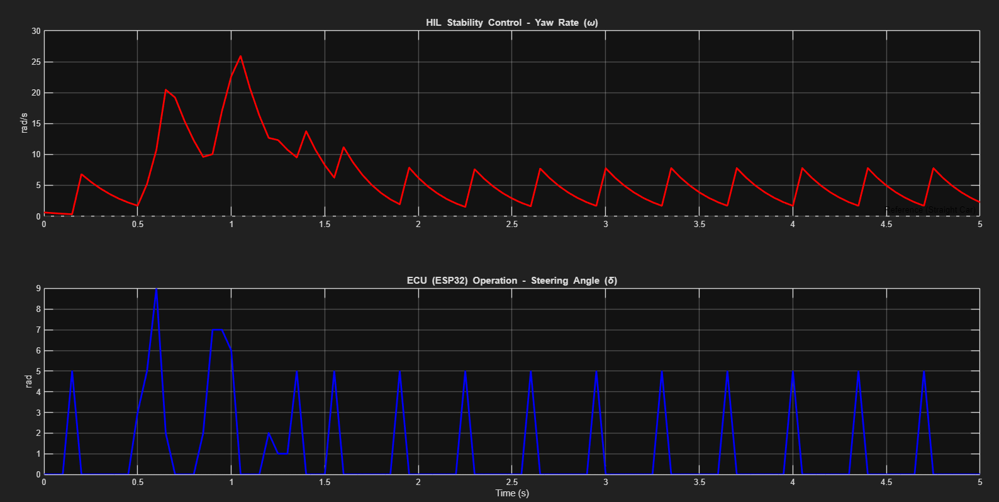
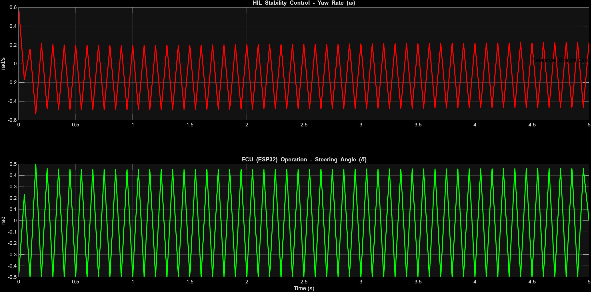
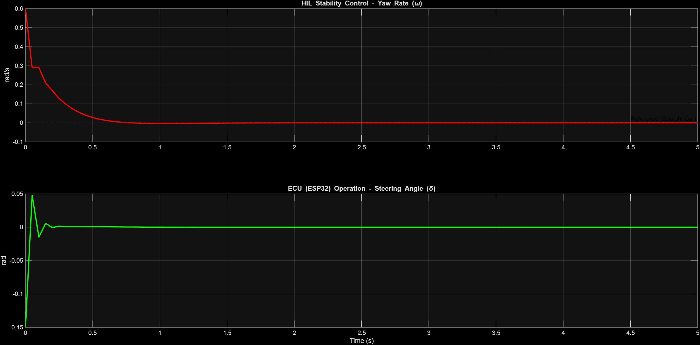

# Vehicle Stability Control System

This implementation aims to apply the bicycle model for cars and, thereby, use a mathematical mechanism to stabilize the vehicle. The computer generates an unstable steering situation, sends this steering data to a hardware device, which then performs the correction and sends it back to the computer. The simulation and graph generation were developed using Matlab software. The hardware used was the ESP-32 S3, with the help of the Espressif framework.






## Running

To run this project, you need to have a version of Matlab software. Another similar software can be used, as long as it is capable of opening a port on the local network.

- To run, simply execute the script in the *matlab* branch:

```bash
  skid_test.m
```

- For the hardware, simply compile the code for the development board. It is important to emphasize that you need to use the serial monitor function to better track the software execution. The code is available in the *embedded_system* branch:

```bash
  src/main.c
```
## How it works?

This section details the physical, mathematical, and control engineering fundamentals used in the development of this **Hardware-in-the-Loop (HIL)** vehicle stability simulator using **MATLAB** and **ESP32**.

### The Mathematical Model (Linear Bicycle Model)

To simulate the dynamic behavior of the car in the **Host (MATLAB)**, environment, the **Linear Bicycle Model** was implemented. This model simplifies the vehicle's four wheels into two imaginary wheels positioned on the center plane (chassis axis of symmetry), according to the ISO 8855 vehicle dynamics standards.

#### Assumptions and Simplifications Adopted:
* The left and right tires of each axle are grouped into a single equivalent central tire.
* The vehicle's movement is restricted to the two-dimensional horizontal plane $(X, Y)$, ignoring roll, pitch, and dynamic vertical weight transfer effects.
* The longitudinal velocity ($v_{lon}$) is considered constant during the integration step.
* The steering angle of the wheels ($\delta$) is small, allowing for small-angle trigonometric approximations: $\cos(\delta) \approx 1$ and $\sin(\delta) \approx \delta$.

#### State-Space Representation

The lateral translational dynamics and the rotational yaw dynamics are coupled through the Newton-Euler laws, resulting in the following continuous linear system:

$$\begin{bmatrix} \dot{v}_{lat} \\ \dot{\omega} \end{bmatrix} = A \begin{bmatrix} v_{lat} \\ \omega \end{bmatrix} + B \delta$$

Where the System States are:
* $v_{lat}$: Vehicle lateral velocity (m/s).
* $\omega$: Yaw Rate, which measures the angular velocity around the vertical Z-axis (rad/s).

The System Input ($u$) is:
* $\delta$: Actual steering angle applied to the front wheels (rad).

The system matrix $A$ and input matrix $B$ are structured based on the physical parameters of the vehicle:

$$A = \begin{bmatrix} -\frac{C_{\alpha,r} + C_{\alpha,f}}{m \cdot v_{lon}} & \frac{C_{\alpha,r} \cdot l_r - C_{\alpha,f} \cdot l_f}{m \cdot v_{lon}} - v_{lon} \\ \frac{l_r C_{\alpha,r} - l_f C_{\alpha,f}}{I_z \cdot v_{lon}} & -\frac{l_f^2 C_{\alpha,f} + l_r^2 C_{\alpha,r}}{I_z \cdot v_{lon}} \end{bmatrix}$$

$$B = \begin{bmatrix} \frac{C_{\alpha,f}}{m} \\ \frac{l_f C_{\alpha,f}}{I_z} \end{bmatrix}$$

| Parameter | Description | Unit |
| :--- | :--- | :--- |
| **$m$** | Total mass of the vehicle | kg |
| **$I_z$** | Rotational moment of inertia around the Z-axis | kg·m² |
| **$l_f$** | Distance from the Center of Gravity (CG) to the front axle | m |
| **$l_r$** | Distance from the Center of Gravity (CG) to the rear axle | m |
| **$C_{\alpha,f}$** | Cornering stiffness of the front tire set | N/rad |
| **$C_{\alpha,r}$** | Cornering stiffness of the rear tire set | N/rad |

---

### Tire-Road Interaction Forces

he generation of lateral forces ($F_y$), which are responsible for making the vehicle turn or keeping its trajectory stable, depends directly on the elastic deformation of the tire tread when interacting with the asphalt. This deformation generates the so-called Slip Angle ($\alpha$).

In the linear operating regime (maneuvers without severe loss of grip), the lateral force generated by each axle is directly proportional to its respective slip angle:

$$F_f = -C_{\alpha,f} \cdot \alpha_f$$
$$F_r = -C_{\alpha,r} \cdot \alpha_r$$

The vehicle's kinematics define the front ($\alpha_f$) and rear ($\alpha_r$) slip angles based on the current velocity state and chassis geometry:

$$\alpha_f \approx \frac{v_{lat} + \omega \cdot l_f}{v_{lon}} - \delta$$
$$\alpha_r \approx \frac{v_{lat} - \omega \cdot l_r}{v_{lon}}$$

The role of our embedded ECU is to monitor $\omega$ and dynamically intervene in the angle $\delta$ to counterbalance the unwanted elastic deviations of the rear tires during a loss of stability (oversteer).


### Real-Time HIL Synchronization

A conventional Hardware-in-the-Loop simulation requires hard real-time operating systems on both the Host and the Target. To overcome this infrastructure barrier in low-cost development setups, we implemented the concept of Event-Driven Lockstep Synchronization via POSIX UDP sockets (`lwip/sockets.h`).

The temporal flow of the loop works in a coordinated step-by-step manner:

* 1 - Physics wait: MATLAB starts the current step $t(k)$, calculates the yaw rate $\omega(k)$ and dispatches this information in a text UDP datagram. The numerical solver (`ode45`) freezes the physical integration and opens an active waiting loop (polling via `NumBytesAvailable`).
* 2 - Target Processing: The ESP32 (blocked on the `recvfrom` socket call) wakes up immediately after receiving the packet, decodes the numeric string, executes the PID controller mathematical routine, and returns the steering command $\delta(k)$ via the `sendto` socket.
* 3 - Temporal Advance: MATLAB receives the return character, clears the network buffer (`flush`), breaks the freeze loop, applies $\delta(k)$ as the plant's input force, and advances the physics to $t(k+1)$, rigidly repeating the cycle every $dt = 50\text{ms}$.


### The Embedded PID Control Algorithm

The embedded software on the ESP32 executes a real-time control algorithm configured to act as a low-level Electronic Stability Control (ESC) system. The controller's goal is to nullify any unwanted rotational disturbance, making the vehicle return to the stable straight-line reference trajectory ($\omega_{ref} = 0$).

#### Discrete Formulation

With each sensor packet received, the task scheduled in FreeRTOS calculates the control action based on the following discrete equations:

$$e(k) = \omega_{ref} - \omega(k)$$

$$P(k) = K_p \cdot e(k)$$
$$I(k) = I(k-1) + K_i \cdot e(k) \cdot dt$$
$$D(k) = K_d \cdot \frac{e(k) - e(k-1)}{dt}$$

$$\delta_{comand}(k) = P(k) + I(k) + D(k)$$

#### Actuator Mechanical Saturation
To simulate the actual physical limitation of a passenger car's steering box, the calculated value goes through a symmetric saturation lock in the C code, preventing physically impossible steering commands:

$$-\delta_{max} \le \delta_{comand} \le \delta_{max} \quad \implies \quad -0.5\text{ rad} \le \delta \le 0.5\text{ rad} \quad (\approx \pm 28.6^{\circ})$$

#### Derivative Kick Damping
In the final system calibrations, the inclusion of the derivative term ($K_d = 0.1$) acted analogously to a torsional viscous damper. 

Since the initial test condition simulates an abrupt vehicle breakaway (instantaneous step of $\omega = 0.6\text{ rad/s}$), the error varies infinitely in the first instant. The derivative portion responds to this instantaneous rate of change with an aggressive actuation peak against the direction of rotation (Derivative Kick), stabilizing the vehicle in half the time compared to purely Proportional control, completely eliminating harmonic oscillations on the track.

## Some results

Some of the results obtained throughout the development and testing.

#### Network issue

In this first graph, I was able to notice a flaw in my code regarding the network. The hardware did not synchronize correctly with the MATLAB software.



#### Results



In this second graph, the car became completely out of control and started making completely absurd steering angles. It was necessary to include some calibrations to avoid this.



In this third graph, I obtained positive and realistic results.

[Awesome README](https://github.com/matiassingers/awesome-readme)


## Course watched

Since I am not a mechanical physicist, I had to look for a YouTube course to learn the theory behind all of this. Personally, I really liked the classes by **Professor Georg Schildbach** from the University of Luebeck. Below I provide the link to the public playlist.

[](https://www.youtube.com/playlist?list=PLW3FM5Kyc2_4PGkumkAHNXzWtgHhaYe1d)
## 🔗 Links
[](www.linkedin.com/in/marcus-leandro-272767178)

